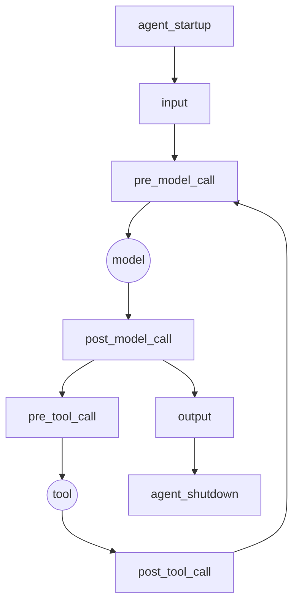

# Agent Hooks

Agent Hooks is a framework-neutral control contract for AI agents. It
defines the eight lifecycle points at which an agent host must consult
registered controls, the JSON context the host supplies at each point,
the verdict a control returns, and the obligations the host must honour
for each verdict. A framework implements the contract once as a host;
a policy engine, approval flow, or audit pipeline plugs in once as an
interceptor and works on every conformant host.

One Rust core implements everything normative. Python, TypeScript,
.NET, and Go bind to it over a C ABI, and Rust hosts use the crate
directly, so the same context produces the same canonical bytes and the
same decisions in all five languages.

!!! warning "Trust model"
    Agent Hooks is a cooperative contract, not a security boundary.
    The host is fully trusted: nothing in the contract detects a host
    that skips interception points or ignores verdicts. Registered
    interceptors are fully trusted by the host and receive raw
    payloads. Conformance is not a security certification. The
    normative statement is [§1.4 of the specification](spec.md).

## The loop



Every box is an interception point: the host constructs an
`AgentContext`, dispatches it to the registered interceptors under a
declared [composition profile](concepts/composition.md), and honours
the combined [verdict](concepts/verdicts.md) before the next arrow is
allowed to happen. A deny at `pre_tool_call` means the tool is never
invoked; a deny at `post_tool_call` means the result never enters agent
state.

## Install

```sh
pip install --pre agent-hooks-sdk        # Python  (import agent_hooks)
npm install @responsibleai/agent-hooks   # TypeScript / Node
cargo add agent-hooks-sdk                # Rust    (crate agent_hooks)
dotnet add package ResponsibleAI.AgentHooks --prerelease
go get github.com/responsibleai/agent-hooks/sdk/go/agenthooks
```

The .NET and Go bindings load the native core library at run time; see
their quickstarts for the one build step this adds today.

## Where to start

- Build a **host** (you maintain an agent framework): start with a
  [quickstart](quickstart/python.md) and then the
  [conformance guide](conformance.md).
- Build an **interceptor** (you maintain a control): read
  [verdicts](concepts/verdicts.md) and the
  [examples](examples/policy-deny.md).
- Evaluate the design: read the [specification](spec.md) and the
  [FAQ](faq.md).
